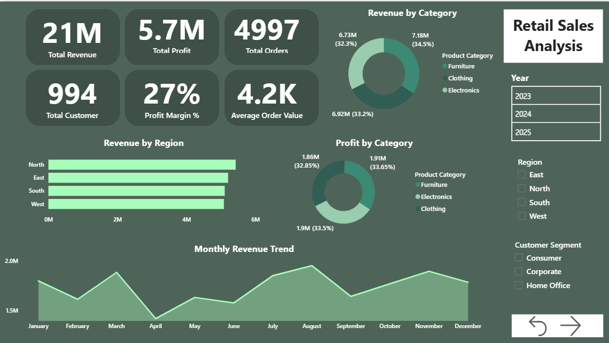
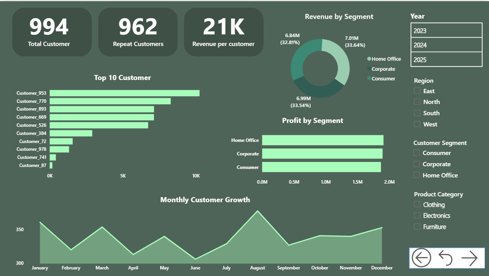
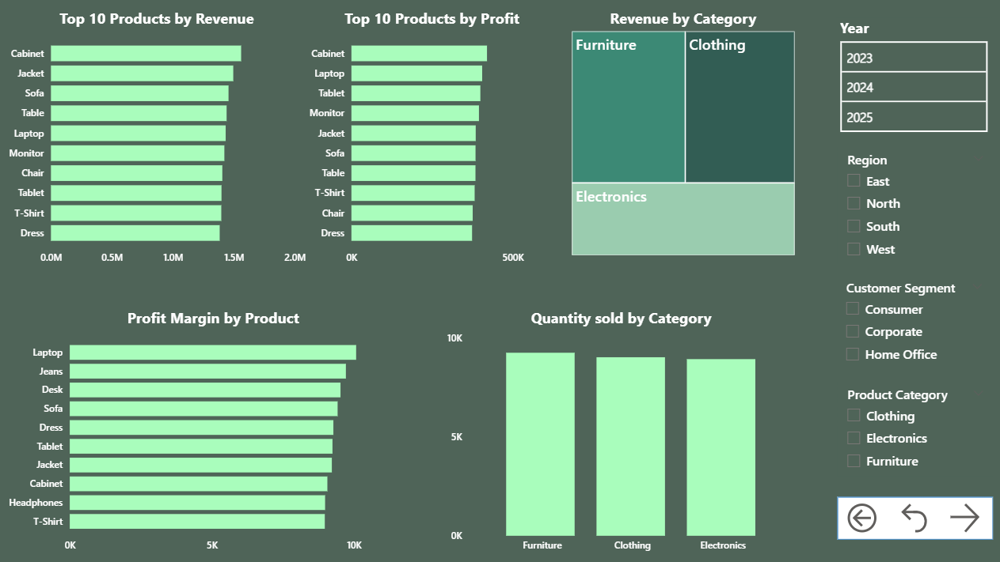
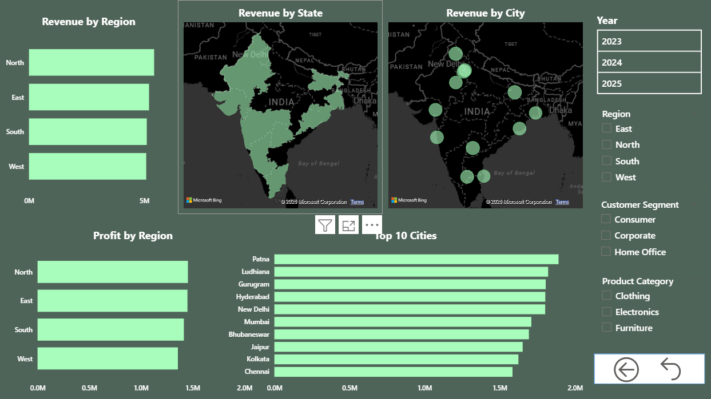

# Retail-Sales-Analytics
Retail Sales Analytics Project using Python and Power BI for business intelligence, KPI tracking, customer insights, and sales performance analysis.

Retail Sales Analytics Dashboard

**Project Overview**

This project analyzes retail sales performance using Python and Power BI. The objective is to identify sales trends, customer behavior, regional performance, and profitability insights that support business decision-making.

**Business Problem**

A retail business operating across India's North, South, East, and West regions needs a single source of truth to answer recurring questions: which regions, states, and cities are driving (or dragging down) revenue and profit; which product categories and individual products are most and least profitable; how customer segments differ in value; and whether sales performance is seasonal or trending. 

**Objectives**

Analyze sales performance

Evaluate profitability trends

Engineer time-based features (year, month, quarter, weekday, year-month cohort) to support trend and seasonality analysis.

Explore the data to identify top/bottom performing products, regions, states, cities, and customer segments

Create interactive dashboards

**Dataset Description**

The dataset contains:

Order ID

Order Date

Customer ID

Customer Name

Region

State

City

Product Category

Product Name

Quantity

Unit Price

Revenue

Cost

Profit

Customer Segment

**Tools & Technologies**

Python

Pandas

NumPy

Matplotlib

Seaborn

Power BI

**Data Cleaning Process**

Removed duplicate records

Converted Order Date to datetime format

Created Year column

Created Month column

Calculated Profit Margin

Verified Profit calculations

**Exploratory Data Analysis**

Monthly Sales Trend

Outlier detection on Revenue and Profit

Revenue by Region

Top Customers

Product Performance

Profitability Analysis

Correlation Analysis

Pareto Analysis

RFM-style aggregation

**Dashboard Features**

The Power BI dashboard is built for self-serve exploration:

Global slicers on every page for Year, Region, Customer Segment, and (where relevant) Product Category, so any view can be filtered without leaving the page.

KPI cards at the top of the Executive Overview and Customer Analysis pages for at-a-glance metrics.

Navigation buttons on each page for moving between report pages.

Mix of chart types — area, line, donut, clustered bar/column, treemap, filled map, and bubble map — chosen to match the analysis 

**Key KPIs**

Total Revenue

Total Profit

Total Orders

Average Order Value

Revenue per Customer

Profit Margin %

**Dashboard Pages**

**Executive Overview**
Business KPIs and performance summary.

**Customer Analysis**
Customer behavior and top customers.

**Product Analysis**
Product sales and profitability analysis.

**Regional Analysis**
Revenue and profit across regions.

**Dashboard Preview**

**Key Insights**

Revenue is evenly spread across regions, with North leading at roughly ₹5.43M and West trailing at roughly ₹5.09M — a gap of only about 7%, meaning no single region is carrying or dragging the business disproportionately.

Furniture is the top category by revenue (≈₹7.18M), narrowly ahead of Clothing (≈₹6.92M) and Electronics (≈₹6.74M), but Electronics has the highest profit margin (≈28.2%) versus Furniture (≈26.6%) and Clothing (≈26.9%) — Furniture sells more but Electronics is more efficient per rupee of revenue.

Cabinet, Jacket, and Sofa are the top three products by revenue, while Cabinet, Laptop, and Tablet are the top three by profit — the highest-revenue product isn't always the highest-profit one, so revenue rankings alone can be misleading for assortment decisions.

Customer segments are nearly balanced: Home Office (≈₹7.01M), Corporate (≈₹6.99M), and Consumer (≈₹6.84M) each contribute roughly a third of revenue, indicating no single segment should be deprioritized.

Year-over-year revenue is essentially flat (≈₹6.93M in 2023, ≈₹6.94M in 2024, ≈₹6.98M in 2025) — growth has stagnated over the three-year window rather than trending up or down.

Customer retention is high: 962 of 994 customers (about 97%) placed more than one order, indicating the existing customer base is largely repeat business rather than one-off purchases.

**Business Recommendations**

**Double down on Electronics margin advantage:** 
since Electronics carries the best profit margin but trails Furniture in revenue, consider targeted promotions or bundling to grow Electronics' share of revenue without sacrificing its margin profile.

**Separate "what sells" from "what's profitable" in merchandising decisions:**
use the Profit Margin by Product view before expanding inventory on high-revenue-but-lower-margin items like Jacket or Sofa.

**Address flat year-over-year growth:**
with revenue essentially unchanged across 2023–2025, investigate whether this reflects market saturation, pricing pressure, or reduced marketing investment, and test region- or segment-specific growth campaigns using the dashboard's slicers to monitor impact.

**Protect and grow the repeat-customer base:**
with a 97% repeat rate, prioritize retention programs (loyalty perks, replenishment reminders) over new-customer acquisition spend, while still monitoring the small new-customer segment for growth opportunities.

**Repository Structure**

Dataset/

PowerBI/

Python/

Dashboard_Screenshots/

Documentation/

**Future Improvements**

Sales forecasting

Customer segmentation

RFM dashboard

Automated reporting

**Author**

Khushi Naagar

Aspiring Data Analyst | Business Intelligence Enthusiast | Power BI & Python
